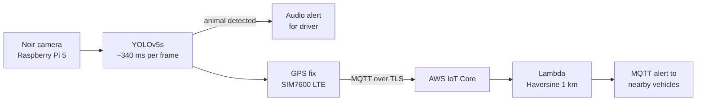

# On-Road Real-Time Animal Detection & Alert System

> Top 100 — 12th National Technology Parade, Jordan
> Graduation Project · Jordan University of Science and Technology · 2024–2025

## Overview

A real-time edge-to-cloud road safety system that detects animals on roads and alerts drivers — including nearby vehicles within a 1 km radius — using collaborative cloud networking and edge AI.

## Performance

| Metric | Value |
|---|---|
| Model | YOLOv5s custom fine-tuned |
| Dataset | 10,108 images — Dog, Horse, Cow, Sheep |
| mAP@0.5 | 83% |
| Inference Speed | ~340 ms per frame (about 3 FPS) on Raspberry Pi 5, video test |
| End-to-End Latency | Under 1.2 seconds (design target) |
| Alert Broadcast Radius | 1 km via GPS and Haversine formula |
| Hardware Cost | About $350 per unit |

## Detection Results by Class

| Animal | Precision | Recall | mAP@0.5 |
|---|---|---|---|
| Dog | 0.861 | 0.812 | 0.842 |
| Horse | 0.871 | 0.793 | 0.836 |
| Cow | 0.814 | 0.679 | 0.778 |
| Sheep | 0.759 | 0.651 | 0.753 |

## How It Works

1. Noir camera captures road footage on Raspberry Pi 5
2. YOLOv5 model detects animals at about 340 ms per frame
3. On detection — audio alert plays immediately for the driver, and the detection is logged locally
4. GPS coordinates retrieved from SIM7600 LTE module
5. Detection data published over MQTT with TLS encryption to AWS IoT Core
6. AWS Lambda stores each device location in DynamoDB and applies the Haversine formula to find all vehicles within 1 km
7. An alert is published back through AWS IoT Core to each nearby vehicle (`raspberry/<device>/alert`)



## Repository structure

```
edge/main.py              Full pipeline: detect -> driver alert -> GPS -> AWS IoT Core, and receive nearby warnings
edge/core.py              Hardware-free helpers (GPS parsing, detection filter, message format, cooldown)
edge/detect.py            Detection-only loop from the report (class + confidence filter)
cloud/gps_publisher.py    Reads GPS from the SIM7600 and publishes to AWS IoT Core over MQTT/TLS
cloud/subscriber.py       Test subscriber for the raspberry/data topic
cloud/lambda_function.py  Lambda: stores device locations in DynamoDB, alerts devices within 1 km
config/data.yaml          YOLOv5 training config (4 classes)
config/wvdial.conf        Cellular dial-up config for the SIM7600
aws/iot-policy.json       Least-privilege IoT policy for the device
aws/iot-rule.sql          IoT rule that forwards messages to Lambda
tests/test_core.py        Unit tests (no hardware needed)
```

The code in `cloud/`, `config/`, `aws/` and `edge/detect.py` is taken from the project report (Chapter 4);
`edge/main.py` connects those parts into one loop, following the report's pseudocode. Model weights, the dataset and the
AWS certificates are not included.

## How to run

On the Raspberry Pi (needs `best.pt` weights, an AWS IoT "Thing" with its X.509 certificates in `./certs/`):

```bash
pip install -r requirements.txt
export DEVICE_ID=vehicle-1
export IOT_ENDPOINT=<your-endpoint>-ats.iot.<region>.amazonaws.com
python edge/main.py
```

`main.py` sends two kinds of messages to `raspberry/data`: a `location` update every 5 s and an
`event` when an animal is detected (at most one per 10 s per sighting). It listens on
`raspberry/<DEVICE_ID>/alert` and plays the alert (`alert.wav` via `aplay`, if present) when a
nearby vehicle reports an animal. Detections are also logged to `detections.csv`.

In AWS: create the IoT policy from `aws/iot-policy.json`, an IoT rule using `aws/iot-rule.sql`
that triggers `cloud/lambda_function.py`, and a DynamoDB table named `DevicesLocation`.

Tests (no hardware or AWS needed):

```bash
pip install pytest
python -m pytest tests
```

## Tech Stack

| Layer | Technology |
|---|---|
| Edge AI | YOLOv5s, Python, OpenCV |
| Hardware | Raspberry Pi 5, Noir Camera, SIM7600 LTE |
| Connectivity | MQTT over TLS, 4G LTE |
| Cloud | AWS IoT Core, Lambda, DynamoDB |
| Security | X.509 Certificates, TLS 1.2 |
| Location | GPS NMEA 0183, Haversine Formula |

## Limits and next steps

- **Weakest classes:** sheep (recall 0.651) and cows (recall 0.679) are missed more often than dogs and horses, so a real deployment needs more training images for them.
- **Four classes only:** the model knows dogs, horses, cows and sheep. Other animals are not detected.
- **Prototype, not a product:** the results above come from the graduation project evaluation, not from long-term road trials. Field testing across day, night and weather is the next step.
- **Connectivity:** alerts rely on the 4G LTE link, so coverage gaps on rural roads would delay warnings.
- **Speed:** about 2-3 FPS on the Pi 5 is fine for slow road scenes but below video frame rates. Inference takes over 97% of the time per frame.
- **Integration test status:** `edge/main.py` was checked with unit tests and a simulated camera, GPS and AWS; it has not yet been re-run on the physical Pi since being combined.

## Team

- Shehab Shibli
- Osama Mohammad Al-Tawra
- Mohammed Yahia
- Naseem Atieh
- Mahmod Mohamad Al-Smadi
- Supervisor: Dr. Fahed Awad

## Recognition

- Top 100 — 12th National Technology Parade, Jordan
- Grade B+ on both Graduation Project phases


